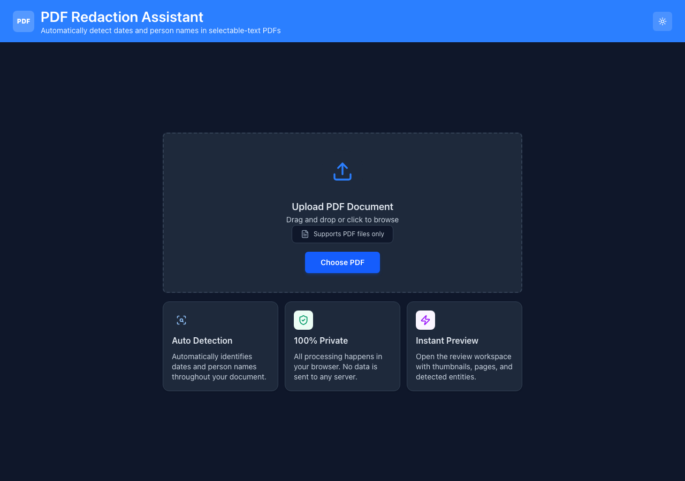

# PDF Redaction Assistant

Browser-only PDF review tool built with React, Vite, TypeScript, pdf.js, and pdf-lib.

The app lets a user upload one or more PDFs, detects likely dates and person names, shows the pages with thumbnails, lets the user select or manually mark text/regions, and exports highlighted or redacted PDFs without a backend.

## Run Locally

```bash
npm install
npm run dev
```

For a production readiness check:

```bash
npm run build
```

## Project Structure

```txt
.
├── index.html                # Vite entry HTML
├── vite.config.ts            # Vite + React + Tailwind config
├── tsconfig.json             # TypeScript config
├── package.json
└── src/
    ├── main.tsx              # App bootstrap; mounts <App>, loads global CSS
    ├── App.tsx               # Document queue owner: upload, validation, active doc
    ├── styles.css            # App-shell / workspace layout styles
    ├── tailwind.css          # Tailwind entry
    ├── theme.css             # Light/dark theme tokens
    │
    ├── components/           # UI (presentation + interaction)
    │   ├── LandingUpload.tsx     # Empty-state upload screen (first view)
    │   ├── FileUpload.tsx        # File <input> / drag-and-drop control
    │   ├── Layout.tsx            # Main workspace controller + per-doc edit state
    │   ├── ThumbnailPanel.tsx    # Left panel: page thumbnail strip
    │   ├── PdfThumbnail.tsx      # One cached page thumbnail + delete
    │   ├── PdfViewer.tsx         # Center panel: toolbar, zoom, page windowing
    │   ├── PdfPage.tsx           # One page: canvas, text layer, overlays, drawing
    │   ├── EntityPanel.tsx       # Right panel: entities, redactions, search
    │   ├── EntitySection.tsx     # Collapsible Dates / Names group
    │   ├── EntityRow.tsx         # One detected-entity row
    │   ├── ColorLegend.tsx       # Date/name color key
    │   ├── InfoBanner.tsx        # Inline status / info messages
    │   └── ThemeToggle.tsx       # Light/dark toggle button
    │
    ├── lib/                  # Logic (no React; unit-testable)
    │   ├── pdfLoader.ts          # Load an ArrayBuffer into pdf.js
    │   ├── pdfText.ts            # Per-page text extraction + PDF coord mapping
    │   ├── datePatterns.ts       # Date regex patterns + matcher
    │   ├── namePatterns.ts       # Title-case name heuristics + blocklists
    │   ├── extractEntities.ts    # Build normalized DetectedEntity records
    │   ├── searchPdf.ts          # Full-document text search
    │   ├── measurePdfHighlightBoxes.ts  # Remeasure boxes vs. offscreen text layer
    │   ├── exportHighlightedPdf.ts      # Draw highlights, collect black-outs, export
    │   ├── rasterizeRedactedPages.ts    # True redaction: flatten redacted pages
    │   ├── exportDocument.ts            # Single-document export pipeline
    │   ├── exportAllAsZip.ts            # Batch ZIP export with unique filenames
    │   ├── documentsReducer.ts          # Multi-document queue reducer
    │   ├── useTheme.ts                  # Theme state + persistence hook
    │   └── pdfErrors.ts                 # pdf.js cancellation-error helper
    │
    └── types/                # Shared TypeScript models
        ├── entity.ts             # EntityType, DetectedEntity, ManualRedaction, ...
        └── document.ts           # DocumentEntry, DocumentEditState, HistoryAction
```

The split is deliberate: `components/` holds React/UI, `lib/` holds framework-free
logic (PDF parsing, entity detection, coordinate math, export), and `types/` holds
the shared data model both sides agree on. See **Problem Decomposition** below for
how these pieces map onto the problems they solve.

## Problem Decomposition

### 1. Load PDFs in the Browser

The first problem is loading arbitrary user PDFs without a backend. `loadPdfDocument` reads the file as an `ArrayBuffer` and passes it to pdf.js. This keeps the project private and avoids external API calls.

Relevant files:

- `src/App.tsx`
- `src/lib/pdfLoader.ts`

### 2. Extract Text and Detect Entities

The second problem is converting PDF text items into a normalized string while preserving enough position data to highlight the source text later. `extractPageTextData` gathers each page's text items, then `findDateMatches` and `findNameMatches` apply lightweight browser-safe heuristics.

Dates are detected with regex patterns for common numeric, month-name, and ISO formats. Names are detected with Title Case heuristics plus blocklists to reduce headings and labels being treated as people.

Relevant files:

- `src/lib/pdfText.ts`
- `src/lib/datePatterns.ts`
- `src/lib/namePatterns.ts`
- `src/lib/extractEntities.ts`

### 3. Convert PDF Coordinates to UI Highlights

PDF text coordinates and browser overlay coordinates use different coordinate systems. The app stores approximate text bounds from pdf.js, then refines highlights against the rendered pdf.js text layer where possible.

This is why detected entities store both text offsets and bounding boxes: offsets help re-measure exact text ranges after rendering, while boxes provide a fallback and support export.

Relevant files:

- `src/lib/pdfText.ts`
- `src/components/PdfPage.tsx`
- `src/lib/measurePdfHighlightBoxes.ts`

### 4. Manage Multi-Document Review State

The app supports multiple uploaded PDFs at once. `App` owns the document queue, while `Layout` owns the active document's live editing state. Each document has its own selections, black-outs, deleted pages, manual redactions, undo stack, and redo stack.

Relevant files:

- `src/App.tsx`
- `src/lib/documentsReducer.ts`
- `src/types/document.ts`
- `src/components/Layout.tsx`

### 5. Render the Review Workspace

The interface is split into three areas:

- Left: page thumbnails and page deletion.
- Center: PDF rendering, zoom, page navigation, highlights, manual text selection, and freehand region drawing.
- Right: detected entities, manual redactions, selection controls, and document search.

Large PDFs use windowed page rendering around the current page so the browser does not render every page canvas at once.

Relevant files:

- `src/components/ThumbnailPanel.tsx`
- `src/components/PdfThumbnail.tsx`
- `src/components/PdfViewer.tsx`
- `src/components/PdfPage.tsx`
- `src/components/EntityPanel.tsx`
- `src/components/EntitySection.tsx`
- `src/components/EntityRow.tsx`

### 6. Export Highlights and True Redactions

Highlight-only exports draw translucent rectangles using pdf-lib. Blacked-out redactions are handled differently: pages containing redactions are rasterized and replaced with flattened images that include the black boxes. This prevents hidden text from remaining extractable underneath the redaction.

The export fails closed if true redaction is requested but no pdf.js document is available for rasterization.

Relevant files:

- `src/lib/exportHighlightedPdf.ts`
- `src/lib/rasterizeRedactedPages.ts`
- `src/lib/exportDocument.ts`
- `src/lib/exportAllAsZip.ts`

## Data Model

### Entity Types

```ts
type EntityType = 'date' | 'name';
```

The app only classifies two entity categories: dates and person names.

### DetectedEntity

```ts
type DetectedEntity = {
  id: string;
  type: EntityType;
  text: string;
  pageNumber: number;
  matchIndex: number;
  pageTextStart: number;
  pageTextEnd: number;
  bbox: TextBounds | null;
  pdfBoxes?: TextBounds[];
};
```

Rationale:

- `id` lets UI state track selections and black-outs reliably.
- `pageNumber` connects the entity to thumbnails, viewer pages, and export pages.
- `pageTextStart` and `pageTextEnd` allow exact text-layer remeasurement.
- `bbox` gives a quick UI/export fallback.
- `pdfBoxes` stores export-ready PDF coordinate boxes when available.

### ManualRedaction

```ts
type ManualRedaction = {
  id: string;
  pageNumber: number;
  category: EntityType;
  text: string;
  boxes: TextBounds[];
  source: 'text' | 'region';
};
```

Rationale:

- Text-selection redactions may have multiple boxes across line breaks.
- Region redactions support image or arbitrary-area redaction.
- `category` reuses the date/name color system and panel grouping.

### DocumentEditState

```ts
type DocumentEditState = {
  currentPage: number;
  deletedPageNumbers: ReadonlySet<number>;
  deletedEntityIds: ReadonlySet<string>;
  activeEntityId: string | null;
  selectedEntityIds: ReadonlySet<string>;
  blackedOutEntityIds: ReadonlySet<string>;
  manualRedactions: ManualRedaction[];
  selectedManualRedactionIds: ReadonlySet<string>;
  blackedOutManualRedactionIds: ReadonlySet<string>;
  activeManualRedactionId: string | null;
  undoStack: HistoryAction[];
  redoStack: HistoryAction[];
};
```

Rationale:

- `Set` values make selection, deletion, and black-out checks fast and explicit.
- State is stored per document so switching tabs preserves each PDF's edits.
- Undo and redo use typed history actions rather than generic snapshots.

## Architecture Decisions

- React + Vite: simple local frontend stack with fast development and static build output.
- pdf.js for reading/rendering: reliable browser PDF parsing, page canvases, text content, and text layer rendering.
- pdf-lib for writing PDFs: supports drawing highlights, deleting pages, embedding rasterized pages, and saving client-side bytes.
- No backend: all PDF processing stays in the browser for privacy and simpler setup.
- Regex/heuristic entity extraction: browser-safe, explainable, and dependency-light. Accuracy is intentionally approximate.
- Normalized entity model: shared by viewer highlights, entity panel rows, search, thumbnails, and export.
- Text offsets plus boxes: offsets support accurate UI highlight measurement; boxes support fallback and export.
- Page rasterization for black-outs: ensures redacted text is not still selectable or extractable under opaque rectangles.
- Fail-closed redaction export: if a true redaction cannot be rasterized, the app aborts export instead of producing a misleading file.
- Windowed page rendering: improves performance for larger documents by rendering pages near the active page.
- Separate document queue and active edit state: keeps multi-PDF workflows manageable without mixing edits between files.

## Known Limitations

- Scanned/image-only PDFs may render but will not produce detected text entities.
- Name detection is heuristic and may miss unusual names or include some false positives.
- Blacked-out pages are rasterized, so non-redacted text on those pages becomes image content rather than selectable vector text.
- Redaction is visual-and-content safe by flattening whole redacted pages, not by surgically rewriting individual PDF text streams.

## Presentation Order

Use this order to explain the project from entry point to export:

1. `src/main.tsx`
   - Show app startup and global CSS/theme initialization.

2. `src/App.tsx`
   - Explain document upload, multi-file queue, validation, loading state, and active document selection.

3. `src/components/LandingUpload.tsx`
   - Show the first screen the user sees: the empty-state upload card, drag-and-drop, and how it hands off to the review workspace once a PDF loads.

4. `src/lib/pdfLoader.ts`
   - Explain how pdf.js loads a local `ArrayBuffer` in the browser.

5. `src/lib/pdfText.ts`
   - Explain page text extraction, normalized page text, text items, bounding boxes, and coordinate conversion.

6. `src/lib/datePatterns.ts` and `src/lib/namePatterns.ts`
   - Explain the two entity detection strategies: regex dates and heuristic Title Case names.

7. `src/lib/extractEntities.ts`
   - Explain how matches become normalized `DetectedEntity` records with ids, page numbers, offsets, and boxes.

8. `src/types/entity.ts` and `src/types/document.ts`
   - Present the data model: detected entities, manual redactions, document entries, edit state, and history actions.

9. `src/lib/documentsReducer.ts`
   - Explain how multiple PDFs are added, selected, removed, and updated.

10. `src/components/Layout.tsx`
    - Explain the main workspace controller: current page, selected entities, deleted pages, undo/redo, search, export, and document tabs.

11. `src/components/ThumbnailPanel.tsx` and `src/components/PdfThumbnail.tsx`
    - Explain page navigation, active page tracking, thumbnail rendering, and page deletion.

12. `src/components/PdfViewer.tsx`
    - Explain zoom controls, fit modes, manual redaction mode, draw-region mode, and page windowing.

13. `src/components/PdfPage.tsx`
    - Explain canvas rendering, text layer rendering, highlight overlays, manual text selection, region drawing, resizing, and black-out toggles.

14. `src/components/EntityPanel.tsx`, `src/components/EntitySection.tsx`, and `src/components/EntityRow.tsx`
    - Explain grouped entity review, filtering, select-all, manual redaction rows, delete actions, and document search.

15. `src/lib/searchPdf.ts`
    - Explain full-document text search and how search results map back to highlighted page locations.

16. `src/lib/measurePdfHighlightBoxes.ts`
    - Explain why export remeasures boxes against an offscreen text layer before writing the final PDF.

17. `src/lib/exportHighlightedPdf.ts`
    - Explain highlight drawing, black-out collection, page deletion, and fail-closed export behavior.

18. `src/lib/rasterizeRedactedPages.ts`
    - Explain true redaction by replacing redacted pages with flattened images.

19. `src/lib/exportDocument.ts` and `src/lib/exportAllAsZip.ts`
    - Explain single-document export, batch ZIP export, and filename de-duplication.

20. Final demo flow
    - Upload a PDF, show detected dates/names, click an entity to jump and highlight it, search arbitrary text, manually draw a redaction region, black out a detected entity, delete a page then undo it, and export the current PDF.
    - Prove the redaction is real: open the exported PDF and try to select/copy the text that was blacked out — it is gone, because the redacted page was flattened to an image rather than covered by an opaque rectangle over still-extractable text.
    - Mention batch ZIP export for redacting multiple PDFs at once.

## Screenshots / Demo



_Above: the landing/upload screen. Replace or supplement this with a screenshot of the three-panel review workspace on a real PDF (detected entities highlighted) before final hand-in — see the demo flow above for what to capture._